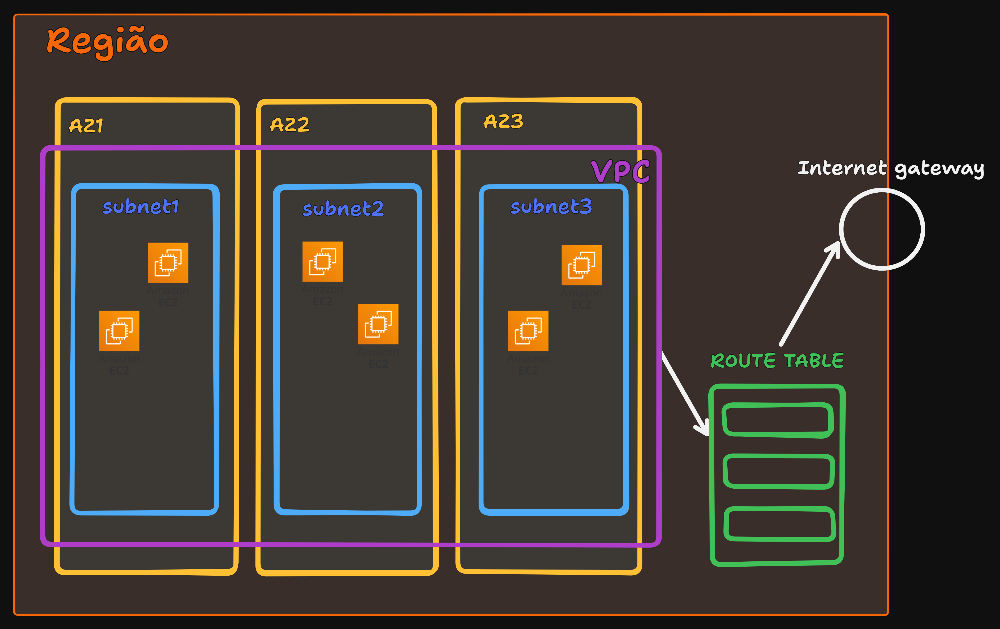

# Redes na AWS

## Amazon VPC (Virtual Provate Cloud)

### Como organizar nossos recursos na AWS?
Em um escritório os computadores seriam conectados por uma série de dispositivos de redes
como roteadores, switches, modems, cabos ethernet, etc.

Na nuvem AWS o serviço responsável por criar uma infraestrutura de redes é o VPC, com ele podemos
contruir e configurar redes virtuais dentro da AWS. Dentro de uma VPC podem existir sub-redes públicas e privadas.

Toda infraestrutura é construida dentro de uma VPC, sem uma VPC não é possivel gerenciar recursos de rede
dentro da AWS. Cada região da AWS possui uma VPC padrão, porém devemos criar novas VPC de acordo com as nossas necessidades.

 
    
    
Figura 1 - Esquema da organização de uma VPC e suas sub-redes dentro de uma Região da AWS.

### Conectividade dentro da AWS
#### Compo podemos conectar uma VPC com a internet?
Por padrão não temos acesso a uma VPC pela internet, para permitir o acesso a uma VPC dentro da AWS devemos criar um **Gateway da Internet**.

Para conectar uma VPC a uma sub-rede privada devemos utilizar uma conexão VPN com um **Gateway privado Virtual** disponibilizado pela AWS.

As empresas podem optar por adquirir um rede dedicada com o **AWS Direct Connect**, esse serviço disponibiliza redes 
dedicadas da internet que permite a conexão de ponta a ponta de um datacenter local até uma VPC na AWS.

### Sub-redes e listas de controle de acesso

#### Como os dados trafegam em uma VPC?
Um cliente envia uma solicitação pela internet que chaga em uma VPC. Será que todos os dados que chegam nessa VPC
seram aceitos? A resposta é não. Existem serviços que bloqueiam requisições que não devem ser realizadas.
- **Network ACLs**:
    - Toda sub-rede é protegida por um Network ACL, que permite configurar o controle de trafego do que entre e sai
    de uma subrede.
    - Possui comportamento Stateless, ou seja, não guarda estado, logo define regras tanto de entrada como de saída de dados.
    - Por padrão, permite todo tráfego de entrada e saída.
- **Grupos de segurança**:
    - Protegem recursos utilizados dentro de uma sub-rede como é o caso das instâncias EC2.
    - Eles fornecem uma camada adicional de segurança para um determinado recurso utilizado dentro da sub-rede.
    - Realiza o controle de tráfego de entrada e saída de instâncias EC2.
    - Possui comportamento Stateful, ou seja, guarda o estado, logo se um pacote entrar ele também pode sair.
    - Por padrão, nega todo o tráfego de entrada e permite todo tráfego de saída.

